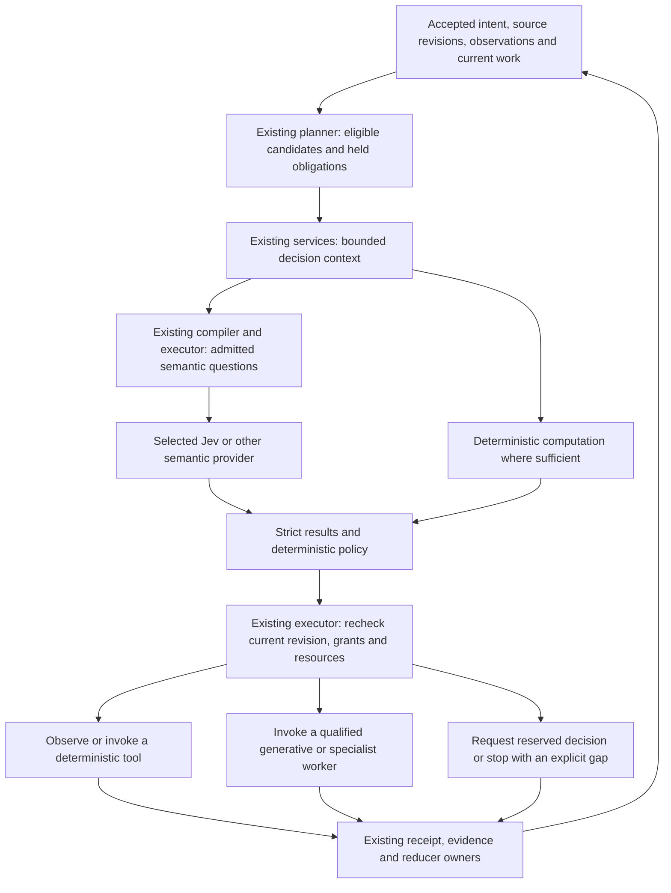

# Decision-driven consumer-app building

Date: 2026-09-20. Status: proposed target extension of [ADR-0016](decisions/0016-compiled-semantic-execution.md), not an enabled runtime or a live Jev qualification.

[North-star architecture](north-star-architecture.md) owns the stable rules. This document specifies how ARCH-02, ARCH-07, ARCH-09 through ARCH-13, ARCH-16 and ARCH-17 apply to continuous build decisions. [Current architecture](architecture.md) distinguishes code present from behavior proved. [Delivery](plans/2026-09-20-decision-driven-building.md) assigns the work to existing issues and owners.

## Decision

Make semantic decision-making part of the execution loop, not only its final review. In an admitted build, Jev should be able to determine the next useful work, the relevant expertise, the appropriate execution route, the next observation, and whether to continue, repair, replan, or escalate. Deterministic policy consumes those decisions and the existing executor performs eligible work.

This is an active routing role. Once a decision family has passed qualification and is enabled under a scoped policy, it does not need a frontier agent to reinterpret every answer or a human to approve every reversible step. Policy may act automatically within existing grants. Shadow mode is an initial proof stage, not the architectural destination.

Jev is the first provider to qualify for this role. The semantic contracts remain provider-neutral. A model that chooses a route is not a second router owner: the existing planner, compiler and executor still own candidate identity, eligibility, ordering, dispatch and history.

The organizing rule is **use the least expensive qualified computation that preserves the required outcome**, not use a small model for everything. Exact work belongs in code. Bounded interpretation belongs in semantic operations. Invention and genuinely new reasoning belong in generative workers. Reserved decisions remain with their established authority.

## Source-backed opportunity and limits

TypeSafe documents intent routing to deterministic handlers, specialist models and humans; progressive skill selection; function selection from a closed vocabulary; and speculative questions evaluated against shared state. These support treating Jev as a routing primitive, not just a test assessor. They do not establish Brigade performance or end-to-end correctness. See the primary sources at the end.

The provider reports Choice and Score distributions plus a derived confidence statistic. Noul returns a proposition value, not a separate confidence field. Do not interpret a confidence of 0.97 as a demonstrated 97 percent probability that a Brigade action is correct. Evaluate thresholds per question family, model, context and consequence.

The documented Jev input is text or structured state, not direct image, audio or video perception. Observation providers may derive text or measurements from those media, but the derivation and its uncertainty must remain visible. Haptic output needs physical evidence. A semantic interpretation cannot upgrade a summary into original device proof.

The model documentation also describes numerical, indirection, irrelevant-context and adversarial-input limitations. Keep arithmetic, identities, authorization, hashes and dependency checks in code. Smaller relevant projections and explicit criteria are part of the architecture, not prompt polish after implementation.

## Baseline: reuse implementation, qualify behavior

Reviewed source: `f3f225a3298b82eee35a5938b1e62fbc2221372d` (`0.221.52`).

| Present owner or source | Reuse | Not established by its presence |
| --- | --- | --- |
| `contracts/semantic/` and #512 / PR #550 | Typed questions, results, plans and receipts | Universal supported decision vocabulary |
| `adapters/providers/typesafe/` and #515 / PR #552 | Encoding, decoding, connection/effect boundary and HTTP transport | Authorized live Jev conformance or measured decision quality |
| `kernel/composition/semantic-plan-lower.ts` and #516 / PR #554 | Pure semantic lowering | Production execution of every proposed operator |
| `kernel/services/source-projection.ts` and #517 / PR #555 | Scoped projections and candidate inputs | Unlimited context or access to arbitrary sources |
| `kernel/session/semantic-batch.ts` and #518 / PR #556 | Batch planning, settlement and resource-accounting seams | Actual asynchronous fanout performance; synchronous barrier fixtures are not that proof |
| Semantic graph and receipt work in #519-#521 / PRs #557, #558, #560 | Derived relationships, reuse, invalidation and applicability | A new authoritative knowledge graph or durable live deployment proof |
| Feedback-to-work slice #522 / PR #561 | Shadow proposal path | Active build routing or acceptance of repairs |
| #523 / PR #572 and #524 | Paper safety/rollout and bounded next-work ranking | Staged admission fixtures are not live enablement |
| #571 / PR #581; `kernel/services/jev-active-routing-qualification.ts` | Paper qualification for active build routing/validation | Paper/fake qualification ≠ authorized live Jev conformance |
| #573 / PR #582; `kernel/services/jev-active-build-loop.ts` | Paper active Jev-directed build loop after ranking | Paper loop ≠ a qualified live Jev-directed build |
| `kernel/session/plan.ts` | Current eligible frontier and bounded briefs; no-write planning | A live model call inside a passive plan |

Some modules contain executable helpers, and the TypeSafe adapter includes a live HTTP transport. Do not call them documentation-only. Conversely, the merged paper/fixture slices — including landed #571 and #573 — do not prove a wired, qualified Jev-controlled build. Inspect the exact call path and evidence before changing either claim. Epic #511 remains OPEN.

## One loop, three computational responsibilities

This diagram adds responsibilities within existing owners, not another service, scheduler, graph database, persistent queue, or mandatory supervisor agent.

### Build-level routing

The existing planner constructs the eligible work set from accepted scope, dependency state, current evidence, provider coverage and grants. Semantic questions assess the remaining judgments: which eligible task addresses the current product gap, whether observation would be more useful than editing, which expertise applies, and which supported worker route fits.

Code combines those results with the recipe's priorities, critical-path constraints, resource conflicts and non-negotiable obligations. It can dispatch several independent tasks, not just choose one global winner. Preserve held and omitted candidates in the explain view. A candidate that was never retrieved cannot be assumed inferior.

### Within-task routing

A worker reaches a meaningful checkpoint after an edit, inspection, test result, new observation, or failure. It submits the changed artifact identities and bounded state through the same semantic execution service. The decision can select another probe, a local repair, a different authorized specialist, another generation attempt, an independent review request, or a deliberate stop.

Interactive sessions use the existing interactive execution model. Do not launch nested copies of the whole business runner. Headless sessions use the current executor. Both consume the same decision contract, freshness checks and receipt meanings. A worker-local loop cannot acquire a private planner, journal, credentials, or acceptance power.

Do not assess after every token or every trivial file read. Trigger assessment when a meaningful state change affects a decision, or reuse a valid stored result. The purpose is less repeated interpretation, not more API calls.

### Open-ended work remains open-ended

A closed answer vocabulary is local to one decision, not a permanent limit on what Brigade can build. If no existing candidate fits, route to bounded exploration or a generative worker to propose new work, hypotheses, tests, or designs. Validate the proposal's scope, dependencies, output contract and effects before making it eligible through existing work-order/composition paths.

Do not fake open-ended generation by asking Jev to emit characters through thousands of choices. Do not turn a generated proposal directly into executable authority. New question packs and policies follow the normal reviewed, versioned contribution path; a live model does not rewrite its own acceptance rules.

## Decisions throughout the business

| Decision family | Semantic contribution | Code and existing owners retain |
| --- | --- | --- |
| Request interpretation | Classify the requested consumer-business job and ambiguity | Explicit user scope and deterministic routing when already clear |
| Next work | Assess relevance to the current product gap and need for observation | Eligibility, dependencies, mandatory work, scheduling and fairness |
| Context and skills | Assess applicability, contradictions and the need for more context | Selected-provider instructions, required guidance and scoped retrieval |
| Decomposition | Compare proposed task splits and identify missing obligations | Accepted work identities, resource claims and dependency validation |
| Execution route | Choose among qualified deterministic tools and worker/model routes | Actual bindings, permissions, modality, deadline and budget |
| Product and design | Assess scoped hypotheses, concept constraints and repair location | Founder intent, originality, non-compensatory constraints and independent review |
| Implementation | Classify a failure and select a relevant next probe or repair candidate | Exact tests, source changes, tool execution and permitted writes |
| Profile construction | Assess state identity, relationship support and unresolved coverage | Original evidence, schema validity, provenance and source truth |
| Change impact | Assess semantic obligations and candidate test relevance | Fingerprint invalidation and mandatory test coverage |
| Recovery | Distinguish evidence-gathering, local repair, escalation and unusable context | Reconciliation of uncertain effects before retry |
| Completion | Assess supported criteria and remaining ambiguity | Required proof, independent acceptance and release authority |
| Improvement | Assess feedback mechanisms and transferable lessons | Measurement comparability, privacy and accepted product changes |

Selecting a cheaper worker route is permitted only within already selected and authorized routes. It cannot silently replace an explicit provider binding. If the decision provider is unavailable, use the declared fallback or expose the hold. Do not discover a credential and treat it as selection.

## A decision contract, not a prompt convention

Extend the existing semantic request, question-pack, inference-receipt and policy-application contracts. The following are required meanings, not newly shipped field names or public operations:

- decision purpose and the exact checkpoint that requested it;
- workspace, product, build, occurrence, attempt and ownership generation;
- accepted constraints plus intended/observed profile references when available;
- material source revisions, evidence identities, projections and omissions;
- finite candidate IDs, their qualified routes, prerequisites and effect classes;
- atomic questions with explicit instructions, criterion meanings and state paths;
- answer vocabulary that includes no-match or insufficient-information behavior;
- policy version, risk class, qualification evidence and predeclared thresholds;
- aggregate question, request, token, money, elapsed-time and escalation bounds;
- complete outcomes, selected and unused alternatives, evidence and reason references;
- the deterministic action selection and its dispatch or refusal receipt.

The routing result binds to a snapshot. Immediately before dispatch, recheck the relevant source revisions, current eligibility, grants, selected bindings, ownership and budget. A fresh inference on old source is still stale. An authorized inference request does not authorize its proposed downstream effect.

A relative best Choice does not establish that any candidate is appropriate. Use an explicit no-match option or a separately scoped applicability check. If a score supplies an ordinal rubric, do not reinterpret it as a measured amount of money, time or user value.

## Parallelize decisions before multiplying agents

Use three existing execution patterns:

1. **Shared-state questions:** assess independent dimensions of one scoped snapshot in one compatible request.
2. **Candidate maps:** assess independent tasks, artifacts or evidence pairs with bounded concurrency.
3. **Speculative assessment:** precompute questions for several possible branches when their inputs and permissions already exist; policy consumes only relevant results.

A question that needs another answer or new evidence runs in a later round. Questions in the same batch do not reason over each other's answers. Shared-state batching does not prove statistical independence between their errors.

Compile a dependency-aware set of rounds. Preserve input omissions and provider limits. Do not send an entire repository, all Product Profiles, or the knowledge library because many questions can be batched. Use bounded retrieval and record the recall loss of candidate pruning.

Inference parallelism, independent worker execution, and device parallelism are different resources. Reuse their existing ownership mechanisms. Speculating about a purchase is not permission to make it. Parallel editing needs non-overlapping ownership or isolated branches/worktrees with serialized integration. Device control still needs exclusive lanes.

Reserve aggregate cost before fanout, including allowed retries and unused speculative branches. Apply request-rate, concurrency, queue, response-size, deadline and cancellation limits across the actual requests, not only a fixture's counter. Retain failed, cancelled and unresolved items in the denominator. Do not claim parallelism makes total work free.

## Product Profiles are the common product representation

`product-profile/v1` is the planned foundational model. It describes product entities, systems, journeys, states, surfaces, interaction contracts and their relationships. An intended profile projects accepted product/design truth; an observed profile projects evidence from a running product. Neither creates a competing authoring store.

A Reference Product Profile is a specialization of the same model with reference provenance and capture constraints. Its shared payload must conform to the base contract. Keep observation mode and reference origin distinguishable, whether the final schema uses separate fields or a compatible envelope. A managed app can also be observed; being a reference is not a new kind of truth.

`product.yaml`, `DESIGN.md`, detailed authored contracts, Git and reducer/evidence owners retain their responsibilities. Profile snapshots record their contributing revisions. Deltas distinguish contradicted behavior from behavior not observed. They cannot quietly rewrite intent to match a defect.

The standalone Dissector accepts a reference product and produces an observed profile. It does not receive a target market or decide what another app should copy. Brigade may later compose reference mechanisms under a separate accepted product decision. That leaves the source profile unchanged.

Use profile subgraphs to select the next useful action: a completion defect can point to progression, profile presentation, persistence, motion and feedback obligations without rediscovering the whole application. Missing profile coverage can itself yield an observation task. Required absence is never inferred from an inaccessible screen.

## Passive reads and active decisions

Keep status, plan, discovery, profile retrieval and knowledge reads inference-free. They return current stored receipts, bounded briefs and any missing or stale decision requirement. A stale route is not silently refreshed during a read.

An admitted active build session can refresh decisions automatically at eligible checkpoints under its budget and grants. It can then consume those receipts and continue execution without a new human prompt for each reversible step. This is how Jev drives the work while `business-plan` remains a trustworthy passive projection.

Do not create a background controller implicitly. Scheduled or event-driven operation requires an existing admitted occurrence or an explicitly configured trigger. The same logic applies to interactive, headless and later scheduled builds.

## Observation, confidence and acceptance

A typed answer can be wrong. A deterministic decoder proves format and membership, not semantic truth. A semantic decision, a policy outcome, an executed action, an observed result and accepted proof are separate records.

Preserve distributions and provider-reported confidence rather than inventing confidence for unsupported types. Do not multiply independent-question scores into a supposed probability that the whole app works. Several model assessments of the same source are not several independent observations.

Before autonomous use, evaluate the exact decision family on held-out cases and task-specific failure costs. Include false-positive acceptance, useful abstention, missed candidates, unsupported conclusions, repeated routing mistakes and reviewer correction effort. A weak result can require narrower autonomy, better evidence, a changed question pack, or no adoption.

Use appropriate observation routes for screenshots, animation timing, sound and haptics. A text-only evaluator may assess an evidence-backed motion report; it has not watched the clip. A copied or generated description must not become independent corroboration.

Frozen criteria, producer/reviewer separation and required device/provider proof stay mandatory. A producer cannot select its own acceptance criteria, manufacture the reviewer receipt, or make its own successful narration count as evidence. Jev can route work to the required reviewer; it cannot erase that role.

## Recovery and stopping

Keep bounded autonomy explicit:

- no valid candidate: gather the named missing evidence, expand candidates through authorized generation, or escalate;
- repeated state/candidate cycle: stop or change strategy under a declared loop policy;
- no useful progress: preserve evidence and escalate rather than spend the remaining budget blindly;
- uncertain external effect: reconcile through the existing owner before considering a retry;
- stale or late result: reject current use and preserve the permitted historical receipt;
- exhausted budget or missing authority: stop affected work while independent authorized work may continue;
- required work complete: request normal completion verification; do not declare release from a route label.

Use deterministic fairness or aging so a cheap easy task cannot indefinitely displace required work. Treat estimated information gain as a ranking heuristic until measured; do not portray it as calibrated expected business value.

## Learning without self-authorizing policy changes

Record decision-to-outcome joins through existing receipt and measurement owners. Distinguish model error, insufficient evidence, missing candidates, wrong policy, executor failure and incorrect product assumptions.

Use replay to evaluate a proposed policy on valid stored distributions without another model call. Reassess when material inputs, question packs or relevant model behavior change. Never train or tune against the final held-out answers. Preserve whole-product and time splits when claiming transferable mechanisms.

Promote improved questions, criteria and policies through normal contribution and composition review. No automatic cross-workspace pooling of private evidence, silent repinning, or self-modifying live acceptance policy. A portable public reference profile does not authorize copying its private captures.

## Worked build trace

This is an illustrative cooking-learning app, not a statement about any reference product or an executed build.

1. Accepted product intent requires practice completion to update progress and the profile. The intended profile links those obligations.
2. Current evidence shows progress updating, but the profile total is stale. Both a persistence inspection and a profile-state inspection are eligible; visual polishing is also eligible but does not address this gap.
3. Scoped questions assess failure location, evidence sufficiency, relevant expertise and useful probes in parallel. Policy selects the two non-conflicting inspections before a repair.
4. A deterministic unit test and UI state observation narrow the issue to a presentation update. A coding worker receives the small affected subgraph, the exact files, invariant and test output, not the full product history.
5. At the next checkpoint, the patch passes its unit test but lacks runtime proof. Routing selects current-device verification rather than more code generation or a declaration of success.
6. A feedback requirement still lacks physical haptic evidence. The result stays unverified; text confidence cannot turn it green. Other independent work continues.
7. Once required observations and independent review are accepted, the existing lifecycle can advance. The decision receipts explain why each action occurred and which alternatives were unused.

## Delivery and proof

The target is a complete **observe → decide → act → inspect → decide** build, not a model demo or a batch benchmark. Extend the landed #523/#524/#571/#573 paper owners under epic #511 rather than create a second execution program. Epic #511 remains OPEN. Product Profile work stays under #562-#570. Packaging and fresh-agent behavior use the existing guidance/evaluation owners.

Prove a bounded vertical slice first, then a structurally different app. Compare against deterministic routing and the current agent-led path with the same task and evidence. Measure actual accepted outcomes, critical-path time, requests, unused speculation, live cost, required-context delivery, correction work, loop failures and human intervention. Break out inference latency from compilation, queueing, observation and tool execution.

Initial shadow and advisory stages must have explicit exit criteria. Promote named decision families to active use only after evidence and policy approval; retain a reversible fallback without discarding history. Do not gate every unrelated profile/schema feature on live Jev access, or make a broad public decision language a prerequisite to the first build slice.

## Primary sources reviewed

Reviewed 2026-09-20. Vendor examples are opportunities and constraints, not Brigade benchmarks or qualification receipts. No SDK code, example assets, or upstream skill is copied by this design.

- [TypeSafe introduction](https://docs.typesafe.ai/introduction): typed decision primitives.
- [Intent routing](https://docs.typesafe.ai/patterns/intent-routing): choosing deterministic, specialist and human handlers.
- [Speculative fan-out](https://docs.typesafe.ai/patterns/fan-out): independent questions and conditional consumption.
- [Skill suggestion](https://docs.typesafe.ai/cookbooks/skill_suggestion): progressive candidate retrieval with a no-fit outcome.
- [Function calling](https://docs.typesafe.ai/cookbooks/function_calling): decisions over known functions and arguments.
- [Confidence](https://docs.typesafe.ai/confidence): distributions, derived confidence and risk-dependent policy.
- [Models](https://docs.typesafe.ai/models): modality, version/alias and capacity facts to recheck during qualification.
- [API](https://docs.typesafe.ai/api): actual typed request and response meanings.
- [Jev 1.13 limitations](https://docs.typesafe.ai/model-jaggedness/jev-1.13): numerical, context, structural and adversarial limitations.
